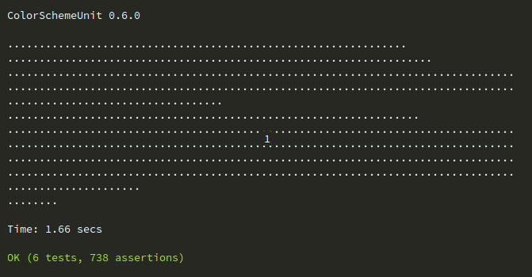

# WHAT COLOR SCHEME UNIT IS

[](https://sublimetext.com) [](https://packagecontrol.io/packages/color_scheme_unit) [](https://github.com/gerardroche/sublime_color_scheme_unit/stargazers) [](https://github.com/gerardroche/sublime_color_scheme_unit/tags) [](https://github.com/gerardroche/sublime_color_scheme_unit) [](https://twitter.com/gerardroche)

Color scheme unit is a testing framework for Sublime Text color schemes.



## OVERVIEW

* [Installation](#installation)
* [Usage](#usage)
* [Tests](#tests)
* [Configuration](#configuration)
* [Contributing](#contributing)
* [Changelog](#changelog)
* [License](#license)

## INSTALLATION

### Package Control

The preferred method of installation is via [Package Control](https://packagecontrol.io/browse/authors/gerardroche).

### Manual

1. Close Sublime Text.
2. Download or clone this repository to a directory named `color_scheme_unit` in the Sublime Text packages directory:
    * Linux: `git clone https://github.com/gerardroche/sublime_color_scheme_unit.git ~/.config/sublime-text-3/Packages/color_scheme_unit`
    * OS X: `git clone https://github.com/gerardroche/sublime_color_scheme_unit.git ~/Library/Application\ Support/Sublime\ Text\ 3/Packages/color_scheme_unit`
    * Windows: `git clone https://github.com/gerardroche/sublime_color_scheme_unit.git %APPDATA%\Sublime/ Text/ 3/Packages/color_scheme_unit`
3. Done!

## USAGE

Command | Description
------- | -----------
`:TestSuite` | Run tests for the current file.
`:TestFile` | Run test suite of the current file.
`:TestResults` | Show the test results panel.
`:ShowScopeAndColors` | Show the scope name and applied colors of scheme at point under cursor.

* Jump to Next Failure: <kbd>F4</kbd>
* Jump to Previous Failure: <kbd>Shift</kbd>+<kbd>F4</kbd>

The following key bindings are disabled by default:

OS X | Windows / Linux | Command
-----|-----------------|--------
<kbd>Command</kbd>+<kbd>Shift</kbd>+<kbd>r</kbd> | <kbd>Ctrl</kbd>+<kbd>Shift</kbd>+<kbd>r</kbd> | `:TestFile`
<kbd>Command</kbd>+<kbd>Shift</kbd>+<kbd>t</kbd> | <kbd>Ctrl</kbd>+<kbd>Shift</kbd>+<kbd>t</kbd> | `:TestSuite`
<kbd>Command</kbd>+<kbd>Shift</kbd>+<kbd>alt</kbd>+<kbd>p</kbd> | <kbd>Ctrl</kbd>+<kbd>Shift</kbd>+<kbd>alt</kbd>+<kbd>p</kbd> | `:ShowScopeAndColors`

## TESTS

Color scheme tests are very similar to the sublime text [syntax definition tests](https://www.sublimetext.com/docs/3/syntax.html).

Test file names must start with `color_scheme_test`.

```
color_scheme_test.css
color_scheme_test.html
color_scheme_test.js
color_scheme_test_104.php
color_scheme_test_short_desciption.css
```

They must be saved within the Packages directory.

Test files **must** uses spaces (not tabs).

The first line of a test file must specify the color scheme and syntax for the tests.

```
<comment_token> COLOR SCHEME TEST "<color_scheme>" "<syntax>"
```

**Examples**

```
# COLOR SCHEME TEST "package/name.tmTheme" "Python"
```

```
<?php // COLOR SCHEME TEST "package/name.tmTheme" "PHP"
```

```
/* COLOR SCHEME TEST "package/name.tmTheme" "CSS" */
```

```
<!-- COLOR SCHEME TEST "package/name.tmTheme" "HTML" -->
```

Each test in the syntax test file must first start the comment token (established on the first line, it doesn't have to be a comment according to the syntax), and then a `^` token.

There is one type of test:

* Caret: `^` this will test the following selector against the scope on the most recent non-test line. It will test it at the same column the `^` is in. Consecutive `^`'s will test each column against the selector. Assertions are specified after the caret. There are three types of assertions: foreground (`fg=#<color>`), background (`bg=#<color>`), and font style (`fs=<comma_delimited_list>`). One or more assertions are required, and **must be specified in the order fg, bg, and fs**.

    ```
    # COLOR SCHEME TEST "package/name.tmTheme" "Python"

    def somefunc(param1='', param2=0):
    # ^ fg=#66d9ef
    # ^ bg=#272822
    # ^ fs=italic
    # ^ fg=#66d9ef bg=#272822 fs=italic
    # ^ fg=#66d9ef bg=#272822
    # ^ fg=#66d9ef fs=italic
    # ^ bg=#272822 fs=italic
    # ^ fg=#66d9ef fs=italic

    >>> message = '''interpreter
    #             ^^^^^^^^^^^^^^ fg=#e6db74
    #             ^^^^^^^^^^^^^^ fs=
    ```

    ```
    <?php // COLOR SCHEME TEST "package/name.tmTheme" "PHP"

    // comment
    // ^^^^^^^ fg=#75715e bg=#272822 fs=italic

    interface Filter {
    // ^ fg=#66d9ef fs=italic
    //        ^ fg=#a6e22e fs=
        public function filter();
    //  ^ fg=#f92672 fs=
    //         ^ fg=#66d9ef fs=italic
    //                  ^ fg=#a6e22e fs=
    }
    ```

    For more examples see [Five Easy Color Schemes](https://github.com/gerardroche/sublime_five_easy_color_schemes) package tests.

Once the above conditions are met, running a test or running all the tests with a color scheme test in an active view will run a single test or all the package tests for that test, and then show the results in an output panel. Next Result (<kbd>F4</kbd>) can be used to navigate to the first failing test, and Previous Result (<kbd>Shift</kbd>+<kbd>F4</kbd>) can be used to navigate to the previous failing test.

A suggested package layout for color schemes.

    .
    ├── name.tmTheme
    └── test
      ├── color_scheme_test.css
      ├── color_scheme_test.html
      ├── color_scheme_test.js
      └── issue
          ├── color_scheme_test_104.php
          └── color_scheme_test_98.php

## CONFIGURATION

Key | Description | Type | Default
----|-------------|------|--------
`color_scheme_unit.keymaps` | Enable the default keymaps. | `boolean` | `false`
`color_scheme_unit.debug` | Enable debug messages. | `boolean` | `false`

Set them globally:

`Menu > Preferences > Settings - User`

```json
{
    "color_scheme_unit.keymaps": true,
    "color_scheme_unit.debug": true
}
```

You can also set them per-project:

`Menu > Project > Edit Project`

```json
{
    "settings": {
        "color_scheme_unit.keymaps": true,
        "color_scheme_unit.debug": true
    }
}
```

## CONTRIBUTING

Your issue reports and pull requests are always welcome.

## CHANGELOG

See [CHANGELOG.md](CHANGELOG.md).

## LICENSE

Released under the [BSD 3-Clause License](LICENSE).
